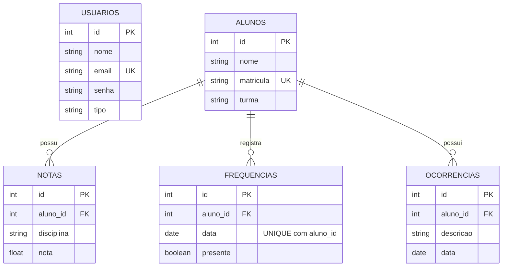

# Diagrama Entidade-Relacionamento — EduConnect

```mermaid
erDiagram
    USUARIOS {
        int id PK
        string nome
        string email UK 
        string senha
        string tipo
    }

    ALUNOS {
        int id PK
        string nome
        string matricula UK
        string turma
    }

    NOTAS {
        int id PK
        int aluno_id FK
        string disciplina
        float nota
    }

    FREQUENCIAS {
        int id PK
        int aluno_id FK
        date data "UNIQUE com aluno_id"
        boolean presente
    }

    OCORRENCIAS {
        int id PK
        int aluno_id FK
        string descricao
        date data
    }

    ALUNOS ||--o{ NOTAS : possui
    ALUNOS ||--o{ FREQUENCIAS : registra
    ALUNOS ||--o{ OCORRENCIAS : possui
```